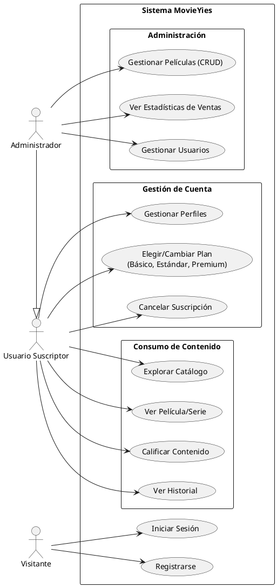
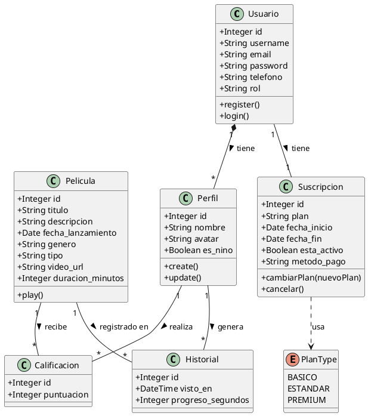
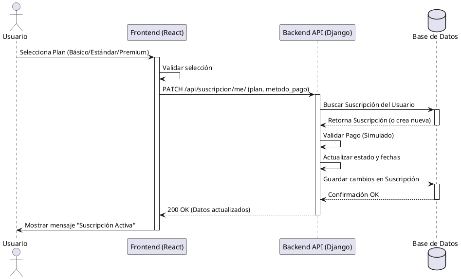
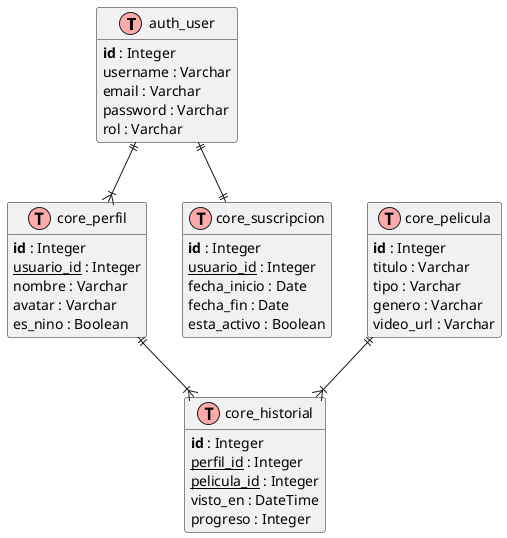
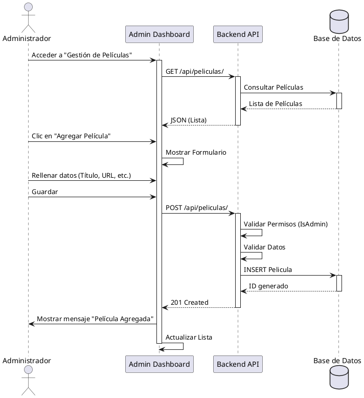
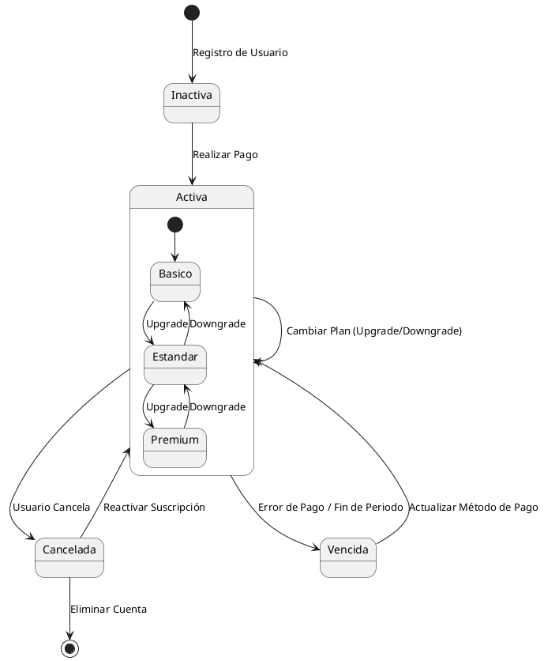
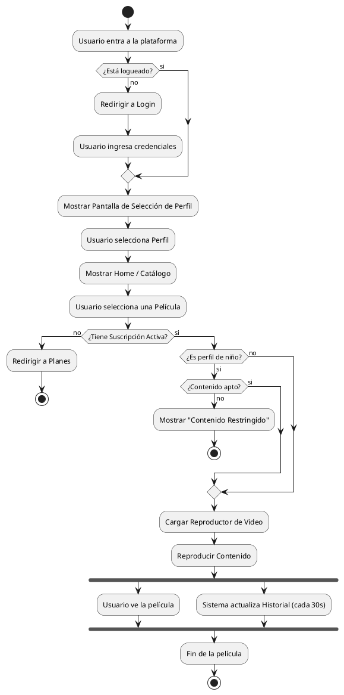
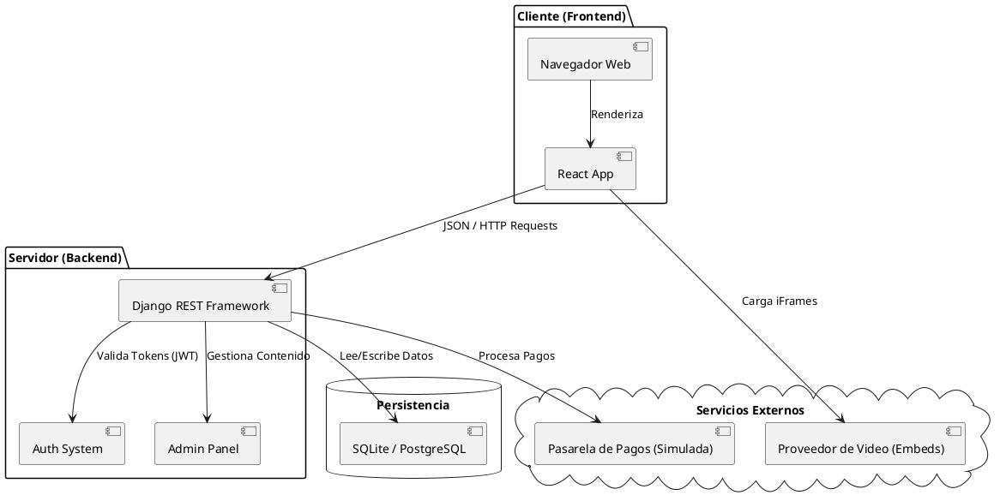

# Manual de Usuario y Documentación Técnica - MovieYies

## 1. Introducción
Bienvenido a **MovieYies**, su plataforma de streaming favorita. Este manual describe el funcionamiento del sistema, desde la perspectiva del usuario final hasta la arquitectura técnica subyacente.

## 2. Funcionalidades Principales

### 2.1 Registro y Autenticación
- **Registro**: Los nuevos usuarios pueden crear una cuenta proporcionando un correo electrónico y una contraseña.
- **Login**: Acceso seguro mediante credenciales.

### 2.2 Gestión de Perfiles
- Cada cuenta de usuario puede tener múltiples perfiles (ej. para diferentes miembros de la familia).
- **Perfiles Kids**: Opción para marcar un perfil como "Infantil" para restringir contenido.

### 2.3 Planes de Suscripción
MovieYies ofrece 3 niveles de servicio para adaptarse a sus necesidades:
1.  **Básico**: Acceso estándar, 1 pantalla.
2.  **Estándar**: Calidad HD, 2 pantallas simultáneas.
3.  **Premium**: Calidad 4K, 4 pantallas simultáneas.

### 2.4 Reproducción de Contenido
- Exploración de catálogo por géneros (Acción, Comedia, etc.).
- Reproductor de video integrado.
- Historial de visualización y "Continuar viendo".

## 3. Panel de Administración
Los administradores tienen acceso a un dashboard exclusivo para:
- Gestionar el catálogo de películas y series (CRUD).
- Ver estadísticas de usuarios y suscripciones activas.

### 3.1 Resumen de Métricas (Dashboard)
Al acceder al panel de administración, el sistema presenta un **tablero de control (Dashboard)** diseñado para ofrecer una visión rápida del estado actual de la plataforma.

1.  **Total Usuarios**: Cantidad total de cuentas registradas.
2.  **Suscripciones Activas**: Usuarios con plan vigente y acceso al contenido.
3.  **Canceladas**: Suscripciones que han expirado o sido canceladas.

---

## 4. Arquitectura del Sistema (Diagramas UML)

A continuación se presentan los diagramas técnicos que describen la estructura y comportamiento del sistema MovieYies.

### 4.1 Diagrama de Casos de Uso
Describe las interacciones entre los usuarios (Visitante, Suscriptor, Admin) y el sistema.

### 4.2 Diagrama de Clases
Representa el modelo de datos y las relaciones entre las entidades principales (Usuario, Perfil, Película, Suscripción).

### 4.3 Diagrama de Secuencia: Compra de Suscripción
Detalla el flujo de información cuando un usuario adquiere un plan.

### 4.4 Diagrama Entidad-Relación (ERD)
Esquema de la base de datos relacional.

### 4.5 Diagrama de Secuencia: Gestión de Películas (Admin)
Muestra el proceso que sigue un administrador para agregar nuevo contenido al catálogo.

### 4.6 Diagrama de Estados: Ciclo de Vida de la Suscripción
Ilustra los diferentes estados por los que puede pasar la suscripción de un usuario.

### 4.7 Diagrama de Actividades: Flujo de Visualización
Describe el flujo de decisiones desde que el usuario entra hasta que ve una película.

### 4.8 Diagrama de Componentes
Muestra la arquitectura de alto nivel y las tecnologías involucradas.

## 5. Referencias Bibliográficas y Tecnologías

El desarrollo de este sistema se ha basado en la documentación oficial de las siguientes tecnologías y herramientas:

### 5.1 Backend y API
*   **Django Project**: Documentación oficial del framework web de alto nivel para Python.
    *   *URL*: [https://docs.djangoproject.com/](https://docs.djangoproject.com/)
*   **Django REST Framework (DRF)**: Herramienta potente y flexible para construir Web APIs.
    *   *URL*: [https://www.django-rest-framework.org/](https://www.django-rest-framework.org/)
*   **Python**: Lenguaje de programación utilizado para la lógica del servidor.
    *   *URL*: [https://docs.python.org/3/](https://docs.python.org/3/)

### 5.2 Frontend e Interfaz
*   **React**: Biblioteca de JavaScript para construir interfaces de usuario.
    *   *URL*: [https://es.react.dev/](https://es.react.dev/)
*   **Vite**: Herramienta de construcción frontend de próxima generación.
    *   *URL*: [https://vitejs.dev/guide/](https://vitejs.dev/guide/)
*   **MDN Web Docs**: Referencia para HTML, CSS y JavaScript estándar.
    *   *URL*: [https://developer.mozilla.org/es/](https://developer.mozilla.org/es/)

### 5.3 Herramientas y Servicios Externos
*   **PlantUML**: Herramienta utilizada para la generación de diagramas UML.
    *   *URL*: [https://plantuml.com/es/](https://plantuml.com/es/)
*   **VidSrc API**: Servicio utilizado para la incrustación de reproductores de video basados en IMDB ID.
    *   *URL*: [https://vidsrc.xyz/](https://vidsrc.xyz/)
